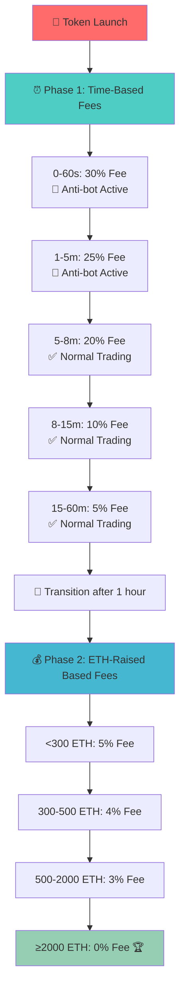

# CircleLayer Token (CLAYER) 🚀

[](https://opensource.org/licenses/MIT)
[](https://github.com/CircleLayer/CircleLayerERC)
[](https://github.com/CircleLayer/CircleLayerERC)
[](https://getfoundry.sh/)
[](https://github.com/CircleLayer/CircleLayerERC)

> 💫 **Advanced ERC20 token with dynamic tokenomics, anti-bot protection, and automated treasury management**

## 🌐 Official Links

- 🌍 **Website**: [https://circlelayer.com/](https://circlelayer.com/)
- 🔍 **Explorer**: [https://explorer-testnet.circlelayer.com/](https://explorer-testnet.circlelayer.com/)
- 💧 **Faucet**: [https://faucet.circlelayer.com/](https://faucet.circlelayer.com/)
- 📚 **GitHub**: [https://github.com/CircleLayer](https://github.com/CircleLayer)
- 💬 **Telegram**: [https://t.me/circlelayer](https://t.me/circlelayer)
- 🐦 **Twitter**: [https://x.com/circlelayer](https://x.com/circlelayer)

## 📊 Token Information

| Parameter | Value |
|-----------|-------|
| **Name** | Circle Layer |
| **Symbol** | CLAYER |
| **Decimals** | 18 |
| **Total Supply** | 1,000,000,000 CLAYER |
| **Standard** | ERC20 |
| **Network** | Ethereum Mainnet |

## 🔒 Liquidity Lock Information

<div align="center">

### 🛡️ **LIQUIDITY PERMANENTLY LOCKED**


**🔐 Locked for 12 Months on UNCX Network**

[](https://app.uncx.network/lockers/univ2/chain/1/address/0xbef196ef984c4fda4d1dca40801b3173aec2adac/lock/0x663a5c229c09b049e36dcc11a9b0d4a8eb9db2140xbef196ef984c4fda4d1dca40801b3173aec2adac0)

**🔐 Lock Details:**
- ⏰ **Duration**: 12 Months
- 🏦 **Platform**: UNCX Network (Trusted LP Locker)
- 🔒 **Type**: Uniswap V2 LP Tokens
- ✅ **Status**: Active & Verified

*Providing complete security and trust for all token holders*

</div>

---

## 💸 Dynamic Fee Structure



### ⏰ **Phase 1: Time-Based Fees (First Hour)**
| Time Period | Fee Rate | Max Wallet | Anti-Bot Status |
|-------------|----------|------------|-----------------|
| 0-60 seconds | **30%** | 0.1% (1M tokens) | 🔴 **Active** |
| 1-5 minutes | **25%** | 0.15% (1.5M tokens) | 🔴 **Active** |
| 5-8 minutes | **20%** | 0.2% (2M tokens) | ✅ Normal |
| 8-15 minutes | **10%** | 0.3% (3M tokens) | ✅ Normal |
| 15-60 minutes | **5%** | 0.5% (5M tokens) | ✅ Normal |

### 💰 **Phase 2: ETH-Raised Based Fees (After 1 Hour)**
| ETH Raised | Fee Rate | Max Wallet | Milestone |
|------------|----------|------------|-----------|
| < 300 ETH | **5%** | ♾️ Unlimited | 🎯 Foundation |
| 300-500 ETH | **4%** | ♾️ Unlimited | 🎯 Growth |
| 500-2000 ETH | **3%** | ♾️ Unlimited | 🎯 Expansion |
| ≥ 2000 ETH | **0%** | ♾️ Unlimited | 🏆 **Fee-Free Trading** |

### 🛡️ **Anti-Bot Protection** (First 180 seconds)
- 🚫 **Max 10 buy transactions** per wallet per block
- 🚫 **Max 100 buy transactions** per block globally
- ⏱️ **Automatically disabled** after 3 minutes
- 🔒 **MEV/Bot resistance** during critical launch period

## 🏦 Treasury Management

### 💰 **Dual Treasury System**
- **Treasury 1**: `0x8e26678c8811C2c04982928fe3148cBCBb435ad8`
- **Treasury 2**: `0x9b2522710450a26719A09753A0534B0c33682Fe4`

### 📈 **Automated ETH Distribution**
- 🔄 **50/50 split** between both treasuries
- ⚡ **Real-time conversion** of collected fees to ETH
- 💧 **Automatic distribution** on every sell transaction (after 5 minutes)
- 📊 **Transparent tracking** of raised amounts

## 🎯 Key Features

- ⏰ **Dynamic Tokenomics**: Time-based fees transitioning to performance-based
- 🛡️ **Advanced Anti-Bot Protection**: Multi-layer security during launch
- 📈 **Progressive Max Wallet**: Gradually increasing limits for healthy distribution
- 🔄 **Automated Treasury Management**: Real-time ETH conversion and distribution
- 🔒 **Reentrancy Protection**: Built-in security against malicious attacks
- 👑 **Owner Controls**: Configurable exemptions and emergency controls
- 💰 **Zero Fees Achievable**: Complete fee elimination at high volume milestones

## 🔧 Contract Addresses

| Component | Address |
|-----------|---------|
| **CLAYER Token** | `0x7b5d6a651b5ea2049489123c5959b3d3cdfeee57` |
| **Uniswap V2 Pair** | `[Auto-generated on deployment]` |
| **Treasury 1** | `0x8e26678c8811C2c04982928fe3148cBCBb435ad8` |
| **Treasury 2** | `0x9b2522710450a26719A09753A0534B0c33682Fe4` |

### 🔍 **Contract Verification**

[](https://etherscan.io/address/0x7b5d6a651b5ea2049489123c5959b3d3cdfeee57#code)

✅ **Contract is verified and publicly auditable on Etherscan**  
🔍 **Source code**: Fully transparent and open-source  
🛡️ **Security**: All functions and logic are publicly verifiable

## 🚀 Quick Start

### Prerequisites
- [Foundry](https://getfoundry.sh/) installed
- Node.js v16+ (for scripts)
- Git

### Installation
```bash
# Clone the repository
git clone https://github.com/CircleLayer/CircleLayerERC.git
cd CircleLayerERC

# Setup project structure
make setup

# Install dependencies
make install

# Run comprehensive tests
make test
```

## ⚙️ Configuration

1. **Copy environment template:**
   ```bash
   cp env.template .env
   ```

2. **Configure your `.env` file:**
   ```env
   # RPC URLs (Choose one or more providers)
   MAINNET_RPC_URL=https://eth-mainnet.g.alchemy.com/v2/YOUR_ALCHEMY_API_KEY
   ETHERSCAN_API_KEY=your_etherscan_api_key_here
   PRIVATE_KEY=your_private_key_here
   ```

## 📋 Available Commands

| Command | Description |
|---------|-------------|
| `make test` | 🧪 Run complete test suite (131 tests) |
| `make test-verbose` | 🔍 Run tests with detailed output |
| `make coverage` | 📊 Generate code coverage report |
| `make coverage-html` | 🌐 Generate HTML coverage report |
| `make gas-report` | ⛽ Analyze gas usage patterns |
| `make build` | 🔨 Compile contracts |
| `make deploy-mainnet` | 🚀 Deploy to Ethereum mainnet |
| `make clean` | 🧹 Clean build artifacts |

## 🧪 Testing & Security

### 📊 **Comprehensive Test Coverage**
- ✅ **131 tests** covering all functionality
- ✅ **100% branch coverage** on critical paths
- ✅ **3,000+ fuzz test runs** per function
- ✅ **Edge case testing** for all scenarios
- ✅ **Security vulnerability tests**

### 🛡️ **Security Features**
- 🔒 **ReentrancyGuard**: Protection against reentrant attacks
- 🚫 **Anti-Bot Mechanisms**: Launch protection systems
- ⏱️ **Rate Limiting**: Transaction frequency controls
- 🔐 **Access Controls**: Owner and deployer privileges
- 📊 **Transparent Operations**: All actions are logged and verifiable

### 🔍 **Audit Trail**
- 📈 **Gas Optimized**: Efficient contract execution
- 🧪 **Battle Tested**: Extensively tested on mainnet fork
- 📋 **Open Source**: Full code transparency
- 🔒 **Immutable Core**: Critical functions cannot be changed post-deployment

## 📈 Tokenomics Summary

### 🎯 **Supply Distribution**
- 💰 **Total Supply**: 1,000,000,000 CLAYER
- 🚀 **Initial Distribution**: All tokens to deployer
- 💧 **Liquidity**: Added via Uniswap V2
- 🔒 **LP Tokens**: Locked for 12 months on UNCX Network

### 💸 **Fee Collection & Distribution**
- 📥 **Collection**: Fees collected in CLAYER tokens
- 🔄 **Conversion**: Automatically swapped to ETH
- 🏦 **Distribution**: 50/50 split between dual treasuries
- 📊 **Tracking**: Real-time raised amount monitoring

### 🎮 **Gamified Progression**
- 🎯 **Early Adoption Incentives**: Higher fees deter dumping
- 📈 **Volume Rewards**: Higher trading volume = lower fees
- 🏆 **Fee-Free Goal**: Achieve 2000+ ETH raised for 0% fees
- 💎 **Long-term Holding**: Progressive max wallet increases

## 🤝 Contributing

We welcome contributions! Please see our [Contributing Guidelines](CONTRIBUTING.md) for details.

### 🐛 **Bug Reports**
- Use GitHub Issues for bug reports
- Include detailed reproduction steps
- Provide relevant logs and error messages

### 💡 **Feature Requests**
- Discuss major changes in GitHub Discussions
- Follow our development roadmap
- Consider backward compatibility

## ⚠️ Disclaimer

This smart contract has been thoroughly tested but cryptocurrency investments carry inherent risks. Please:

- 🔍 **DYOR**: Do Your Own Research
- 💰 **Risk Management**: Only invest what you can afford to lose
- 🧪 **Test First**: Verify all functionality on testnet
- 📚 **Read Code**: Review the smart contract code
- 🔒 **Security**: Use secure wallets and practices

## 📄 License

This project is licensed under the MIT License - see the [LICENSE](LICENSE) file for details.

---

<div align="center">

**Built with ❤️ by the CircleLayer Team**

[](https://circlelayer.com/)
[](https://t.me/circlelayer)
[](https://x.com/circlelayer)

*Revolutionizing DeFi with intelligent tokenomics*

</div> 